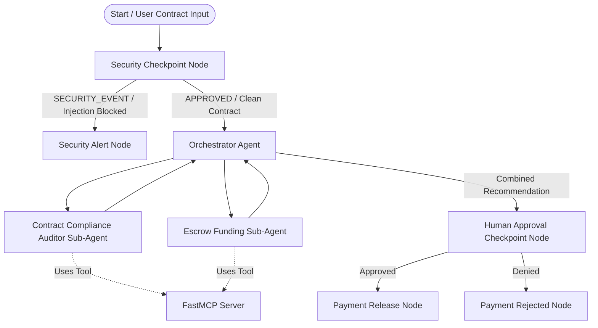

# Sentinel Escrow: Technical Submission Write-Up

## Problem Statement
In financial transactions, escrow systems act as trusted third parties to secure funds until contract conditions are met. However, traditional escrow flows are prone to several critical vulnerabilities:
1.  **Manual Errors**: Compliance checks and bank detail verification are often done manually, causing slow execution and transcription mistakes.
2.  **Security Risks**: Input text describing agreements can contain private data (PII) or malicious prompt injections trying to trick LLM agents into unauthorized releases.
3.  **Lack of Verification**: Automated scripts might release funds to sanctioned entities or without checking account balances first.

`sentinel-escrow` solves this by automating financial compliance and bank verification using a secure multi-agent workflow that preserves security and keeps a human in the loop.

---

## Solution Architecture

The agent architecture uses a sequential/branched graph that separates concerns across security, orchestration, audit sub-agents, and payment release nodes:

---

## Concepts & Implementations Used

### 1. ADK Workflow Graph
The workflow is defined as a graph in [agent.py](file:///c:/Users/Karthik/OneDrive/Documents/adk%20workspace/sentinel-escrow/app/agent.py#L224-L233). It manages state transitions between the function nodes and agent nodes using `Workflow` and `Context`.

### 2. Specialized LlmAgents
We declare three LlmAgents in [agent.py](file:///c:/Users/Karthik/OneDrive/Documents/adk%20workspace/sentinel-escrow/app/agent.py):
*   `orchestrator` (Line 153): Coordinates the process by delegating tasks and forming a final audit recommendation.
*   `contract_auditor_agent` (Line 120): Verifies contract compliance.
*   `escrow_funding_agent` (Line 137): Audits escrow accounts and routes.

### 3. AgentTool Delegation
The `orchestrator` utilizes `AgentTool` in its `tools` configuration (Line 161) to call both the `contract_auditor_agent` and the `escrow_funding_agent` dynamically during execution.

### 4. Model Context Protocol (MCP) Server
We created a custom stdio MCP server in [mcp_server.py](file:///c:/Users/Karthik/OneDrive/Documents/adk%20workspace/sentinel-escrow/app/mcp_server.py) using `FastMCP`. The server is connected as a client-side tool using `McpToolset` in [agent.py](file:///c:/Users/Karthik/OneDrive/Documents/adk%20workspace/sentinel-escrow/app/agent.py#L109-L114) and passed to the agents.

### 5. Security Checkpoint (FunctionNode)
The `security_node` (Line 96 in `agent.py`) acts as the gateway to the LLM agents. It intercepts incoming text, redacts sensitive data, checks for injections, and prevents unauthenticated execution.

### 6. Agents CLI
The project is scaffolded using `agents-cli` and includes a `Makefile` (Line 1 in `Makefile`) to automate installations, local execution, playground runs, and testing.

---

## Security Design

The escrow validator implements four layers of security protection:
1.  **PII Scrubbing**: Active regular expressions check and redact Social Security Numbers (SSNs) and Credit Card numbers to prevent data leakage in LLM contexts.
2.  **Prompt Injection Detection**: Scans user input for adversarial override instructions (e.g. *"ignore previous instructions"*). Detected violations route to a security alert terminal node, preventing downstream LLMs from processing the injection.
3.  **Structured JSON Audit Logging**: Emits clean logs (`AUDIT_LOG: {"timestamp": ..., "has_injection": ..., "severity": ...}`) to track validation details and alert security teams of anomalies.
4.  **Escrow Transaction Limits**: A custom financial safeguard checking for amounts exceeding $50,000.00, escalating severity levels to `WARNING` in the audit log.

---

## MCP Server Design

The MCP server in `app/mcp_server.py` implements four tools:
1.  `get_escrow_balance(account_id: str) -> float`: Simulates querying a core banking ledger to verify that the escrow account holds sufficient funds for the transaction.
2.  `verify_bank_routing(routing_number: str) -> bool`: Verifies that routing numbers are valid registered 9-digit combinations.
3.  `check_blacklist_payee(name: str) -> bool`: Cross-references the payee against a simulated sanctions blacklist (e.g. *darkweb llc*, *malware corp*, *scam inc*) for AML compliance.
4.  `log_escrow_transaction(action: str, amount: float, payee: str) -> str`: Records the final validation action in a secure audit log file/console ledger.

---

## Human-in-the-Loop (HITL) Flow

A fundamental design constraint for financial workflows is that an AI agent should never possess unilateral authority to transfer real money. 

The `human_approval_checkpoint` node (Line 194 in `agent.py`) pauses the workflow after the orchestrator completes its audit. It yields a `RequestInput` with the schema `ApprovalDecision`. The workflow remains suspended in the ADK state store until a human administrator reviews the orchestrator's recommendation and explicitly selects to **Approve** or **Deny** the release, along with custom comments.

---

## Impact / Value Statement

*   **Mitigates Financial Fraud**: Automated screening of payees and bank routing validation blocks transfers to sanctioned entities or invalid accounts.
*   **Ensures Compliance & Auditability**: Redacts sensitive data before model dispatch and creates clear audit logs for financial regulators.
*   **Empowers Human Ops**: Reduces repetitive validation tasks by doing the compliance prep-work, while keeping final release authority securely in human hands.
